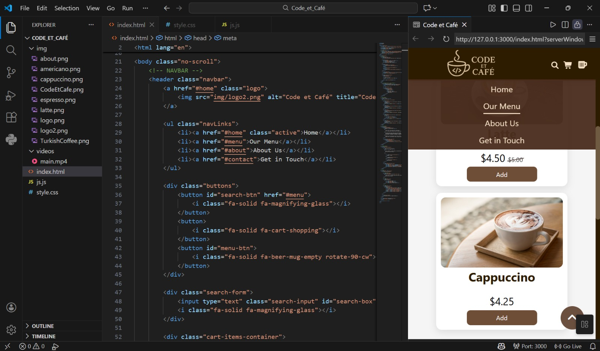

# Code et Café  ||  _a website project_

  

---

## 🍪 About
**Cafe et Code** is a simple web page project that demonstrates modern web development practices using HTML, CSS, and JavaScript. This project features animations, a responsive layout, and interactive elements to create an engaging user experience.

---

## 🚀 Features

- Clean and modern UI design
- Responsive layout (mobile-friendly)
- Smooth scroll and hover effects
- Scroll-to-top button
- Interactive navigation bar
- Search functionality for menu items
- Animated page elements
- Modular and well-structured code
- Consistent color palette & typography
- Accessible and semantic HTML structure

---

## ☕ Website

 - <a href="https://fatmassm.github.io/Code_et_Cafe/" target="_blank" rel="noopener noreferrer">
     Code et Café 🤎
  </a>
  
---

## 👩‍💻 Author
- fatmaSsm

